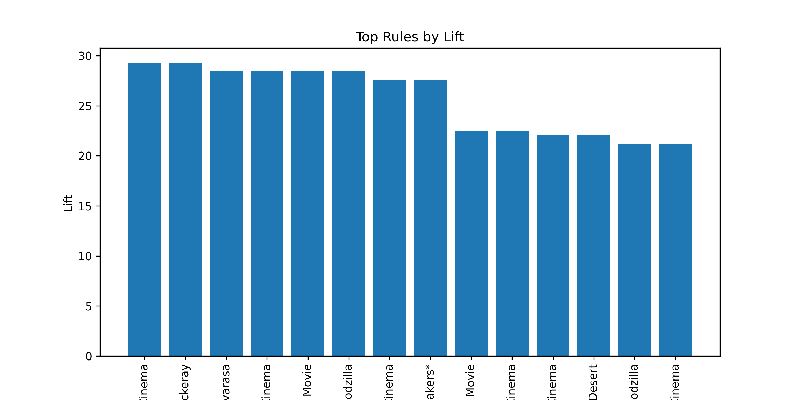
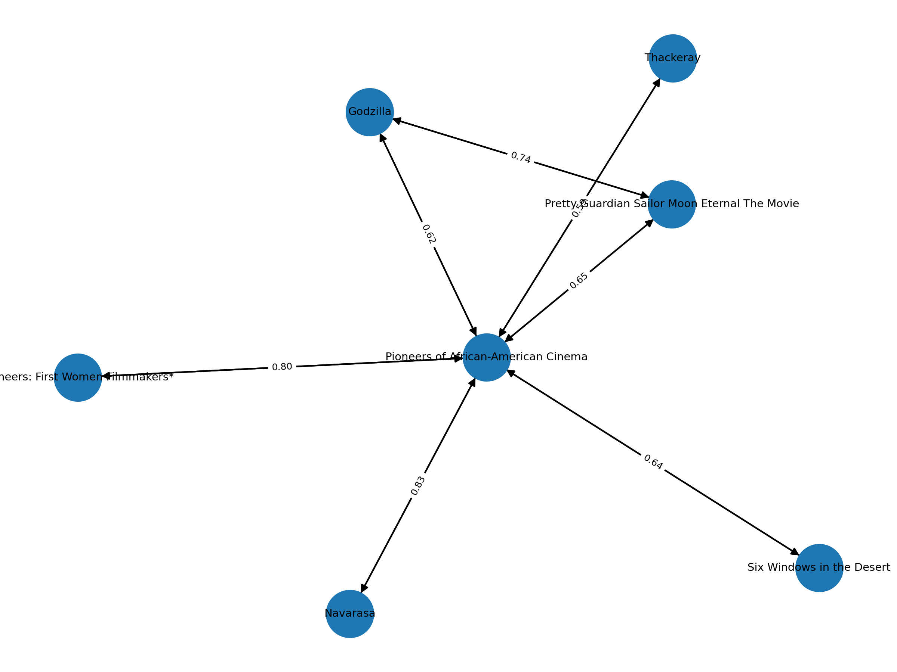

# Apriori Algorithm

Algoritmo de análise de _dataset_ sobre catálogo de streaming, conforme atividade de algoritmo Apriori proposta na disciplina de Aprendizado de Máquina.

# Equipe

* Cristian Prochnow
* Gustavo Henrique Dias
* Lucas Willian de Souza Serpa
* Marlon de Souza
* Ryan Gabriel Mazzei Bromati

# Datasets

* [Catálogo Netflix](./assets/netflix_titles.csv) ([fonte](https://www.kaggle.com/datasets/shivamb/netflix-shows))

# Destrinchando o Algoritimo:

| Etapa | O que acontece |
|-------|----------------------------------|
| **1. Ler o catálogo** | Ele abre o arquivo CSV da Netflix que contém todos os títulos e seus gêneros (Drama, Comédia, etc.). |
| **2. Obter um “histórico de visualizações”** | • Se você já tiver um arquivo real dizendo “usuário X viu o título Y”, ele usa isso.<br>• Se você não tiver, ele **inventa** um histórico plausível: escolhe 1–3 gêneros para cada usuário fictício e sorteia de 3 a 10 filmes/séries desses gêneros. |
| **3. Contar combinações populares** | Para cada título, ele mede quantas vezes aparece nas listas dos usuários (= **suporte**). Depois, conta quantas vezes *pares* de títulos aparecem juntos. |
| **4. Criar as “regras de associação”** | Quando o par A + B é comum o bastante, ele calcula:<br>  • **Confiança** – quão frequentemente quem vê A também vê B.<br>  • **Lift** – quanto essa coincidência é maior que o acaso.<br>Se confiança e suporte forem altos, nasce a regra “Quem vê A costuma ver B”. Guarda só as mais fortes. |
| **5. Salvar e ilustrar** | Grava um **CSV** com as melhores regras e gera dois **gráficos PNG**: |

<br>
<br>

• Barras mostrando o *lift* de cada regra.

• Um grafo (rede) ligando títulos, onde a espessura da seta indica a confiança. 

<br>
<br>

| Termo técnico | Tradução livre |
|---------------|---------------|
| **Transação** | Conjunto de títulos que um usuário assistiu. |
| **Suporte**   | % de usuários que viram um título (ou um par de títulos). |
| **Confiança** | Entre quem viu A, qual % também viu B. |
| **Lift**      | O “quanto acima do acaso” a regra é boa (valor > 1 indica algo interessante). |

## Como rodar:

```bash

python main.py --catalog netflix_titles.csv --watch_history watch_history_synthetic.csv --min_support 0.015 --min_conf 0.25 --top_n 30

```

# Resultados:

### 1. Conjunto de regras (amostra)

| antecedent                                               | consequent                                               | support | confidence | lift |
|----------------------------------------------------------|----------------------------------------------------------|---------|------------|------|
| Thackeray                                                | Pioneers of African-American Cinema                     | 0.017   | 0.85       | 29.31 |
| Pioneers of African-American Cinema                      | Thackeray                                                | 0.017   | 0.5862     | 29.31 |
| Pioneers of African-American Cinema                      | Navarasa                                                 | 0.019   | 0.6552     | 28.49 |
| Navarasa                                                 | Pioneers of African-American Cinema                     | 0.019   | 0.8261     | 28.49 |
| Godzilla                                                 | Pretty Guardian Sailor Moon Eternal The Movie           | 0.017   | 0.6538     | 28.43 |
| Pretty Guardian Sailor Moon Eternal The Movie            | Godzilla                                                 | 0.017   | 0.7391     | 28.43 |
| Pioneers: First Women Filmmakers*                        | Pioneers of African-American Cinema                     | 0.016   | 0.80       | 27.59 |
| Pioneers of African-American Cinema                      | Pioneers: First Women Filmmakers*                       | 0.016   | 0.5517     | 27.59 |
| Pioneers of African-American Cinema                      | Pretty Guardian Sailor Moon Eternal The Movie           | 0.015   | 0.5172     | 22.49 |
| Pretty Guardian Sailor Moon Eternal The Movie            | Pioneers of African-American Cinema                     | 0.015   | 0.6522     | 22.49 |
| Six Windows in the Desert                                | Pioneers of African-American Cinema                     | 0.016   | 0.64       | 22.07 |
| Pioneers of African-American Cinema                      | Six Windows in the Desert                               | 0.016   | 0.5517     | 22.07 |
| Pioneers of African-American Cinema                      | Godzilla                                                 | 0.016   | 0.5517     | 21.22 |
| Godzilla                                                 | Pioneers of African-American Cinema                     | 0.016   | 0.6154     | 21.22 |

*Valores arredondados para quatro casas decimais onde necessário.*

---

### 2. O que cada coluna significa

| Coluna       | Função na regra | Interpretação simples |
|--------------|-----------------|-----------------------|
| **antecedent** | “Se o usuário viu…” | Título já assistido. |
| **consequent** | “…então provavelmente verá” | Título recomendado. |
| **support**   | Popularidade conjunta | Percentual de usuários que viram **ambos** os títulos. |
| **confidence** | Precisão | Entre quem viu o antecedent, quantos viram o consequent. |
| **lift**      | Força da relação | Quanto a coincidência é maior que o acaso (valor > 1 = associação real). |

---

### 3. Métricas resumidas

| Métrica | Pergunta respondida | Faixa típica | Como usar |
|---------|--------------------|--------------|-----------|
| **Support** | “Essa combinação é comum o bastante?” | 0 – 1 | Filtrar regras muito raras para evitar ruído. |
| **Confidence** | “Qual a chance de clicar na sugestão?” | 0 – 1 | Métrica de acerto bruta; quanto maior, melhor. |
| **Lift** | “Quão especial é essa relação?” | > 1 bom<br>≈ 1 irrelevante<br>< 1 negativa | Ótimo para ranquear: valores altos indicam forte afinidade. |

## Gráficos gerados:


<div align='center'>


**Gráfico de lift:**




**Rede de Afinidades (confidence) entre filmes:**



</div>